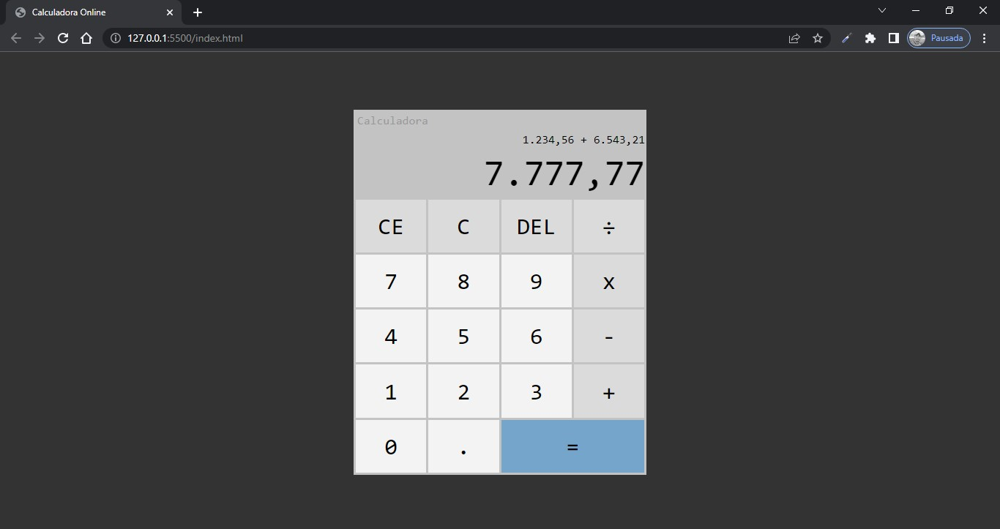

# 🔢 Calculadora :challenge

## A famosa calculadora do desenvolvedor aprendiz

----

## 🛠 Recursos:
- ### Página única

Display duplo;

Operações básicas;

Teclado físico habilitado;

Funções:

Apagar último dígito;

Apagar valor atual;

Apagar tudo e reiniciar.

----

## 💻 Tecnologias utilizadas
 

 

  com foco em:

  

----

## ✒️ Design
- ### Simples, inspirada na calculadora do Windows 10.

----

## Legenda
:challenge - Projeto realizado a partir de um modelo

----

 

<a href="https://raimonesbarros.github.io/Calculadora/"><button style='padding:.5em; background-color:skyblue; border-radius:.5em; font-weight:bold'> 📤 Usar a calculadora 📤 </button> </a>

 

----
----
